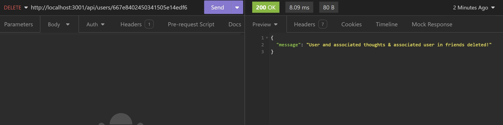
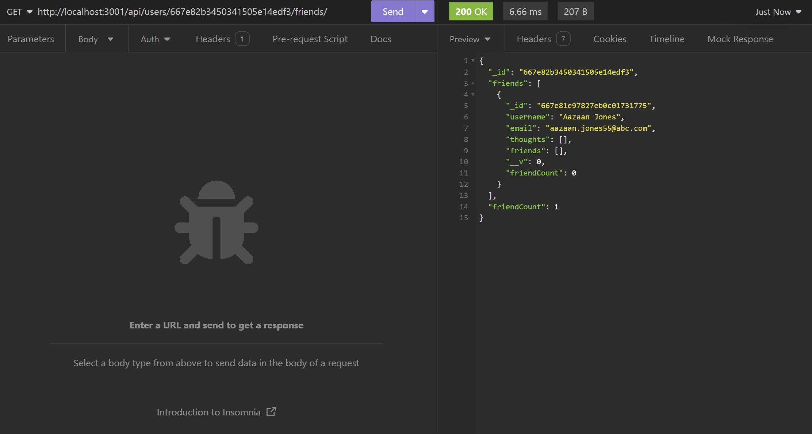

[](https://opensource.org/licenses/MIT)

<p align="left">
    
    
    
    
</p>

# social-network

## Description

- This project is to build an API for a social network web application where users can share their thoughts, react to friends’ thoughts, and create a friend list using MongoDB.
- MongoDB is a popular choice for many social networks due to its speed with large amounts of data and flexibility with unstructured data and building the API is the first step towards working with the data.
- This project is installed with a seed data.
- During this implementation, I was able to apply my knowledge on MongoDB, Embedded Documents, Model Schemas, Model Instance Mehtods, Mongoose, Sub Documents, Virtuals.

## Table of Contents

- [Installation](#installation)
- [User Story](#user-story)
- [Usage](#usage)
- [Usage Screenshots](#usage-screenshots)
- [Acceptance Criteria](#acceptance-criteria)
- [Tests](#tests)
- [Credits](#credits-and-helpful-resources)
- [License](#license)
- [Questions](#questions)

## Installation

Follow these instructions to create your project and deploy it to GitHub Pages:

1. Create a new repository on your GitHub account and clone it to your computer.

2. When you're ready to deploy, use the git add, git commit, and git push commands to save and push your code to your GitHub repository.

3. Navigate to your GitHub repository in the browser and then select the Settings tab on the right side of the page.

4. On the Settings page, select Pages on the left side of the page. On the GitHub Pages screen, choose main in the dropdown under Branch. Click the Save button.

5. Navigate to <your-github-username.github.io/your-repository-name> and you will find that your new webpage has gone live! For example, if your GitHub username is "lernantino" and the project is "css-demo-site", then your URL would be <lernantino.github.io/css-demo-site>.

6. To ensure that the node_modules folder is not pushed in the GITHUB, the .gitignore has to be updated and included.

## User-Story

```md
AS A social media startup
I WANT an API for my social network that uses a NoSQL database
SO THAT my website can handle large amounts of unstructured data
```

## Usage

1. Open the terminal and navigate to the project path \*\*\social-network , run the command npm install to create the initial seed data for the application.
2. On completion of seeding, run the command npm start to start the application.
3. Open Insomnia to execute the APIs as per the requirement.

**Link for the repository :**

https://github.com/shwetakadam5/social-network

**Link for the functionality demo :**
Quick Demo (Important):
https://www.loom.com/share/e138f6ca5739423491bb2f12c9bb254f?sid=fc29e0a0-3f86-4821-9736-8ff117d150fa

## Usage Screenshots

#### 1. **_Social-Network :Get All Users:_**


#### 2. **_Social-Network :Get User By ID:_**


#### 3. **_Social-Network :Create New User:_**


#### 4. **_Social-Network :Update User By ID:_**


#### 5. **_Social-Network :Delet User By ID:_**



#### 6. **_Social-Network :Get All Thoughts:_**


#### 7. **_Social-Network :Get Thought By ID:_**


#### 8. **_Social-Network :Create New Thought:_**


#### 9. **_Social-Network :Update Thought By ID:_**


#### 10. **_Social-Network :Delete Thought By ID:_**


#### 11. **_Social-Network :Get Reactions on Thought ID:_**


#### 12. **_Social-Network :Create Reaction on Thought ID:_**


#### 13. **_Social-Network :Delete Reaction from a Thought ID:_**


#### 14. **_Social-Network :Get Friends of User ID:_**



#### 15. **_Social-Network :Add Friends to User ID:_**


#### 16. **_Social-Network :Delete Friends of User ID:_**


## Acceptance-Criteria

```md
GIVEN a social network API
WHEN I enter the command to invoke the application
THEN my server is started and the Mongoose models are synced to the MongoDB database
WHEN I open API GET routes in Insomnia for users and thoughts
THEN the data for each of these routes is displayed in a formatted JSON
WHEN I test API POST, PUT, and DELETE routes in Insomnia
THEN I am able to successfully create, update, and delete users and thoughts in my database
WHEN I test API POST and DELETE routes in Insomnia
THEN I am able to successfully create and delete reactions to thoughts and add and remove friends to a user’s friend list
```

## Tests

Examples of Errors :

#### 1. **_Social-Network :Error : Invalid ID :_**


#### 2. **_Social-Network :Error : User not found for the ID :_**


#### 3. **_Social-Network :Error : Required check for User name :_**


#### 4. **_Social-Network :Error : Valid format check for email id :_**


#### 1. **_Social-Network :Error :Duplicate Value check for User name:_**


## Credits and Helpful Resources

- [Mongoose Guide](https://mongoosejs.com/docs/guides.html)

- [MongoDB installation guide on The Full-Stack Blog](https://coding-boot-camp.github.io/full-stack/mongodb/how-to-install-mongodb)

- [Express.js](https://www.npmjs.com/package/express)

- [Mongoose package](https://www.npmjs.com/package/mongoose)

## License

> [MIT License](https://opensource.org/licenses/MIT)

## Questions

> _For any queries, please feel free to contact on the following :_
>
> > - Git Hub Profile : <https://github.com/shwetakadam5>
> > - E-mail Address : <shwetakadam5@gmail.com>
